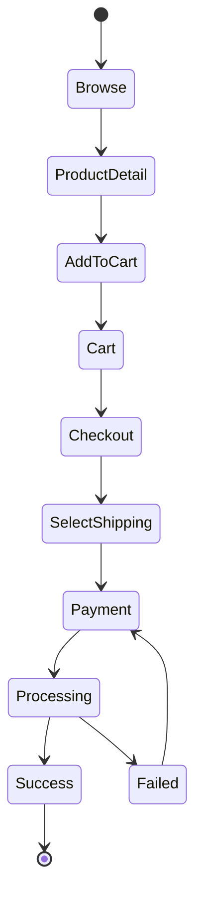

# PROJECT REQUIREMENTS DOCUMENT
# MINIMODA - E-COMMERCE PLATFORM

**Version:** 1.0  
**Date:** December 2024  
**Status:** Draft  
**Classification:** Confidential

---

## DOCUMENT CONTROL

| Version | Date | Author | Description |
|---------|------|--------|-------------|
| 1.0 | Dec 2024 | Development Team | Initial Draft |

## APPROVAL SIGN-OFF

| Role | Name | Signature | Date |
|------|------|-----------|------|
| Project Sponsor | | | |
| Project Manager | | | |
| Technical Lead | | | |
| Business Owner | | | |

---

## TABLE OF CONTENTS

1. [Executive Summary](#1-executive-summary)
2. [Project Overview](#2-project-overview)
3. [Business Requirements](#3-business-requirements)
4. [Technical Architecture](#4-technical-architecture)
5. [Database Design](#5-database-design)
6. [System Flow & Diagrams](#6-system-flow--diagrams)
7. [Functional Requirements](#7-functional-requirements)
8. [Non-Functional Requirements](#8-non-functional-requirements)
9. [Third-Party Integrations](#9-third-party-integrations)
10. [Project Timeline](#10-project-timeline)
11. [Risk Assessment](#11-risk-assessment)
12. [Appendices](#12-appendices)

---

## 1. EXECUTIVE SUMMARY

### 1.1 Purpose
This document outlines the complete requirements for developing Minimoda, a comprehensive e-commerce platform specializing in children's clothing. The platform will consist of two main Laravel applications: a backend system (API + Admin Panel) and a frontend storefront.

### 1.2 Scope
The project encompasses:
- Full e-commerce functionality with product management
- Integrated payment gateway system
- Real-time shipping calculation and tracking
- Comprehensive admin backoffice
- Customer-facing responsive storefront

### 1.3 Objectives
- Launch a scalable e-commerce platform within 3-4 months
- Support 10,000+ concurrent users
- Process 1,000+ daily transactions
- Achieve <2 second page load time
- Maintain 99.9% uptime

---

## 2. PROJECT OVERVIEW

### 2.1 Business Context
**Company:** Minimoda  
**Industry:** Children's Fashion E-commerce  
**Target Market:** Parents aged 25-40 in Indonesia  
**Product Range:** Children's clothing (0-12 years)

### 2.2 Project Deliverables
1. Backend Application (API + Admin Panel)
2. Frontend Storefront Application
3. Database Architecture
4. Integration with Payment & Shipping Providers
5. Documentation & Training Materials

### 2.3 Stakeholders

| Stakeholder | Role | Responsibility |
|-------------|------|----------------|
| Business Owner | Decision Maker | Final approval, requirements validation |
| Project Manager | Coordinator | Timeline, resource management |
| Development Team | Implementation | System development and testing |
| End Users | Customers | Platform usage and feedback |
| Admin Users | Operations | Daily management and operations |

---

## 3. BUSINESS REQUIREMENTS

### 3.1 Functional Business Requirements

#### 3.1.1 Customer Requirements
- **Account Management**
  - Registration with email/phone verification
  - Social login (Google, Facebook)
  - Profile management
  - Multiple delivery addresses
  - Order history tracking

- **Shopping Experience**
  - Product browsing with filters
  - Advanced search functionality
  - Product comparison
  - Wishlist management
  - Guest checkout option

- **Transaction Process**
  - Shopping cart management
  - Real-time shipping cost calculation
  - Multiple payment methods
  - Order tracking
  - Invoice generation

#### 3.1.2 Admin Requirements
- **Product Management**
  - Bulk product upload/update
  - Inventory tracking
  - Category management
  - Price management
  - Discount/promotion setup

- **Order Processing**
  - Order status management
  - Payment verification
  - Shipping label generation
  - Return/refund processing
  - Customer communication

- **Analytics & Reporting**
  - Sales reports
  - Product performance
  - Customer analytics
  - Financial reports
  - Export capabilities

### 3.2 Business Rules
1. Minimum order value: Rp 50,000
2. Maximum cart items: 50 products
3. Order cancellation allowed within 2 hours
4. Return period: 7 days from delivery
5. Stock reservation: 2 hours for unpaid orders

---

## 4. TECHNICAL ARCHITECTURE

### 4.1 System Architecture (Practical Approach)

```
┌─────────────────────────────────────────────────────────┐
│                     MINIMODA ARCHITECTURE                │
├─────────────────────────────────────────────────────────┤
│                                                          │
│  ┌──────────────┐         ┌──────────────┐            │
│  │   Frontend   │ ──API──▶│   Backend    │            │
│  │  Storefront  │         │  API + Admin  │            │
│  └──────────────┘         └──────────────┘            │
│         │                        │                      │
│         ▼                        ▼                      │
│  ┌──────────────┐         ┌──────────────┐            │
│  │     CDN      │         │  PostgreSQL   │            │
│  │   (Assets)   │         │   Database    │            │
│  └──────────────┘         └──────────────┘            │
│                                  │                      │
│                           ┌──────────────┐            │
│                           │    Redis      │            │
│                           │    Cache      │            │
│                           └──────────────┘            │
└─────────────────────────────────────────────────────────┘
```

### 4.2 Technology Stack (Simplified)

#### Backend Application
| Component | Technology | Version | Purpose |
|-----------|------------|---------|----------|
| Framework | Laravel | 11.x | Core backend framework |
| Database | PostgreSQL | 16 | Primary data storage |
| Cache | File/Redis | Latest | Session & cache (Redis optional) |
| Queue | Database | Built-in | Background jobs (simple) |
| API Auth | Laravel Sanctum | Latest | API authentication |

#### Frontend Application
| Component | Technology | Version | Purpose |
|-----------|------------|---------|----------|
| Framework | Laravel | 11.x | Frontend framework |
| Template | Blade/Inertia | Latest | View layer |
| CSS | Tailwind CSS | 3.x | Styling |
| JavaScript | Alpine/Vue | Latest | Interactivity (minimal) |

### 4.3 Development Approach

**Practical Architecture Principles:**
- Repository pattern for database abstraction (without interfaces)
- Service layer only for complex business logic
- Direct Eloquent usage for simple CRUD
- Helpers for reusable utilities
- Constants for status management
- Laravel's built-in features over custom solutions
- Progressive enhancement (start simple, refactor when needed)

### 4.4 Infrastructure Requirements

#### Development Environment
- Local development with Laravel Valet/Sail
- PostgreSQL 16
- Redis (optional)
- PHP 8.3

#### Production Environment (Minimal)
- **Server:** VPS with 4GB RAM minimum
- **OS:** Ubuntu 22.04 LTS
- **Web Server:** Nginx
- **SSL:** Let's Encrypt
- **Monitoring:** Basic logging

---

## 5. DATABASE DESIGN

### 5.1 Database Schema Overview

```sql
-- Schema Structure
schemas:
  ├── public (main business logic)
  ├── auth (authentication related)
  ├── audit (logging and tracking)
  └── analytics (reporting data)
```

### 5.2 Complete Tables Structure

#### Users & Authentication
```
users
├── id (UUID PRIMARY KEY)
├── name (VARCHAR 255)
├── email (VARCHAR 255 UNIQUE)
├── phone (VARCHAR 20)
├── password (VARCHAR 255)
├── role (ENUM: customer, admin, super_admin)
├── email_verified_at (TIMESTAMP)
├── phone_verified_at (TIMESTAMP)
├── last_login_at (TIMESTAMP)
├── status (ENUM: active, suspended, deleted)
├── created_at (TIMESTAMP)
└── updated_at (TIMESTAMP)

customer_addresses
├── id (UUID PRIMARY KEY)
├── user_id (FK)
├── label (VARCHAR 100)
├── recipient_name (VARCHAR 255)
├── phone (VARCHAR 20)
├── province_id (INTEGER)
├── city_id (INTEGER)
├── subdistrict_id (INTEGER)
├── address (TEXT)
├── postal_code (VARCHAR 10)
├── coordinates (POINT)
├── is_default (BOOLEAN)
├── created_at (TIMESTAMP)
└── updated_at (TIMESTAMP)
```

#### Product Catalog
```
categories
├── id (UUID PRIMARY KEY)
├── name (VARCHAR 255)
├── slug (VARCHAR 255 UNIQUE)
├── parent_id (FK SELF)
├── image (VARCHAR 500)
├── description (TEXT)
├── sort_order (INTEGER)
├── is_active (BOOLEAN)
├── created_at (TIMESTAMP)
└── updated_at (TIMESTAMP)

brands
├── id (UUID PRIMARY KEY)
├── name (VARCHAR 255)
├── slug (VARCHAR 255 UNIQUE)
├── logo (VARCHAR 500)
├── description (TEXT)
├── is_active (BOOLEAN)
├── created_at (TIMESTAMP)
└── updated_at (TIMESTAMP)

products
├── id (UUID PRIMARY KEY)
├── name (VARCHAR 255)
├── slug (VARCHAR 255 UNIQUE)
├── description (TEXT)
├── brand_id (FK)
├── age_min (INTEGER)
├── age_max (INTEGER)
├── tags (TEXT[])
├── status (ENUM: active, inactive, draft)
├── seo_meta (JSONB)
├── view_count (INTEGER DEFAULT 0)
├── is_featured (BOOLEAN DEFAULT FALSE)
├── created_at (TIMESTAMP)
└── updated_at (TIMESTAMP)

product_categories
├── product_id (FK)
├── category_id (FK)
└── PRIMARY KEY (product_id, category_id)

product_variants
├── id (UUID PRIMARY KEY)
├── product_id (FK)
├── sku (VARCHAR 100 UNIQUE)
├── size (VARCHAR 50)
├── color (VARCHAR 50)
├── weight_gram (INTEGER)
├── price (NUMERIC(12,2))
├── compare_at_price (NUMERIC(12,2))
├── stock_quantity (INTEGER)
├── barcode (VARCHAR 100)
├── created_at (TIMESTAMP)
└── updated_at (TIMESTAMP)

product_images
├── id (UUID PRIMARY KEY)
├── product_id (FK)
├── url (VARCHAR 500)
├── alt_text (VARCHAR 255)
├── is_primary (BOOLEAN DEFAULT FALSE)
├── sort_order (INTEGER)
├── created_at (TIMESTAMP)
└── updated_at (TIMESTAMP)
```

#### Promotions
```
coupons
├── id (UUID PRIMARY KEY)
├── code (VARCHAR 50 UNIQUE)
├── type (ENUM: percentage, amount)
├── value (NUMERIC(12,2))
├── min_order_amount (NUMERIC(12,2))
├── max_discount_amount (NUMERIC(12,2))
├── max_uses (INTEGER)
├── per_user_limit (INTEGER)
├── used_count (INTEGER DEFAULT 0)
├── applicable_categories (UUID[])
├── excluded_products (UUID[])
├── start_at (TIMESTAMP)
├── end_at (TIMESTAMP)
├── is_active (BOOLEAN)
├── created_at (TIMESTAMP)
└── updated_at (TIMESTAMP)

coupon_usages
├── id (UUID PRIMARY KEY)
├── coupon_id (FK)
├── user_id (FK)
├── order_id (FK)
├── discount_amount (NUMERIC(12,2))
├── used_at (TIMESTAMP)
```

#### Shopping Cart & Orders
```
carts
├── id (UUID PRIMARY KEY)
├── user_id (FK NULLABLE)
├── guest_token (VARCHAR 100)
├── expires_at (TIMESTAMP)
├── created_at (TIMESTAMP)
└── updated_at (TIMESTAMP)

cart_items
├── id (UUID PRIMARY KEY)
├── cart_id (FK)
├── product_variant_id (FK)
├── quantity (INTEGER)
├── price_snapshot (NUMERIC(12,2))
├── created_at (TIMESTAMP)
└── updated_at (TIMESTAMP)

orders
├── id (UUID PRIMARY KEY)
├── order_code (VARCHAR 50 UNIQUE)
├── user_id (FK NULLABLE)
├── customer_name (VARCHAR 255)
├── customer_email (VARCHAR 255)
├── customer_phone (VARCHAR 20)
├── subtotal (NUMERIC(12,2))
├── shipping_cost (NUMERIC(12,2))
├── discount_total (NUMERIC(12,2))
├── tax_amount (NUMERIC(12,2))
├── grand_total (NUMERIC(12,2))
├── payment_status (ENUM: pending, paid, failed, refunded)
├── fulfillment_status (ENUM: unfulfilled, processing, packed, shipped, delivered, returned)
├── courier (VARCHAR 50)
├── service (VARCHAR 100)
├── airwaybill (VARCHAR 100)
├── shipping_address_json (JSONB)
├── notes (TEXT)
├── cancelled_at (TIMESTAMP)
├── cancelled_reason (TEXT)
├── created_at (TIMESTAMP)
└── updated_at (TIMESTAMP)

order_items
├── id (UUID PRIMARY KEY)
├── order_id (FK)
├── product_variant_id (FK)
├── product_name_snapshot (VARCHAR 255)
├── size (VARCHAR 50)
├── color (VARCHAR 50)
├── price (NUMERIC(12,2))
├── quantity (INTEGER)
├── weight_gram (INTEGER)
├── subtotal (NUMERIC(12,2))
├── created_at (TIMESTAMP)
└── updated_at (TIMESTAMP)
```

#### Payments & Shipping
```
payments
├── id (UUID PRIMARY KEY)
├── order_id (FK)
├── provider (VARCHAR 50)
├── transaction_id (VARCHAR 100)
├── method (VARCHAR 50)
├── amount (NUMERIC(12,2))
├── status (ENUM: pending, success, failed, expired, refunded)
├── raw_payload (JSONB)
├── paid_at (TIMESTAMP)
├── created_at (TIMESTAMP)
└── updated_at (TIMESTAMP)

payment_logs
├── id (UUID PRIMARY KEY)
├── payment_id (FK)
├── event (VARCHAR 100)
├── data (JSONB)
├── created_at (TIMESTAMP)

shipments
├── id (UUID PRIMARY KEY)
├── order_id (FK)
├── courier (VARCHAR 50)
├── service (VARCHAR 100)
├── cost (NUMERIC(12,2))
├── etd (VARCHAR 50)
├── airwaybill (VARCHAR 100)
├── raw_tracking (JSONB)
├── shipped_at (TIMESTAMP)
├── delivered_at (TIMESTAMP)
├── created_at (TIMESTAMP)
└── updated_at (TIMESTAMP)

shipment_trackings
├── id (UUID PRIMARY KEY)
├── shipment_id (FK)
├── status (VARCHAR 100)
├── description (TEXT)
├── location (VARCHAR 255)
├── timestamp (TIMESTAMP)
├── raw_data (JSONB)
└── created_at (TIMESTAMP)
```

#### System & Logs
```
activity_logs
├── id (UUID PRIMARY KEY)
├── actor_type (VARCHAR 50)
├── actor_id (UUID)
├── action (VARCHAR 100)
├── object_type (VARCHAR 50)
├── object_id (UUID)
├── meta (JSONB)
├── ip_address (INET)
├── user_agent (TEXT)
├── created_at (TIMESTAMP)

settings
├── key (VARCHAR 100 PRIMARY KEY)
├── value (JSONB)
├── description (TEXT)
├── updated_at (TIMESTAMP)

notifications
├── id (UUID PRIMARY KEY)
├── user_id (FK)
├── type (VARCHAR 50)
├── title (VARCHAR 255)
├── message (TEXT)
├── data (JSONB)
├── read_at (TIMESTAMP)
├── created_at (TIMESTAMP)
```

### 5.3 PostgreSQL Specific Features

- **UUID Primary Keys:** Using gen_random_uuid() for distributed systems
- **JSONB Columns:** Flexible attributes and metadata storage
- **Array Types:** Native array support for tags and categories
- **Full-Text Search:** Using tsvector for product search
- **Partial Indexes:** Optimizing queries on active records
- **Table Partitioning:** For orders, payments, and activity_logs by date range
- **GIN Indexes:** For JSONB and array columns
- **POINT Type:** For geospatial coordinates

---

## 6. SYSTEM FLOW & DIAGRAMS

### 6.1 Use Case Diagram

```
┌─────────────────────────────────────────────┐
│              MINIMODA USE CASES             │
├─────────────────────────────────────────────┤
│                                             │
│     Customer                   Admin        │
│        ○                         ○          │
│        │                         │          │
│    ┌───┼───┐                ┌───┼───┐      │
│    │Browse │                │Manage │      │
│    │Product│                │Product│      │
│    └───────┘                └───────┘      │
│    ┌───────┐                ┌───────┐      │
│    │Add to │                │Process│      │
│    │Cart   │                │Orders │      │
│    └───────┘                └───────┘      │
│    ┌───────┐                ┌───────┐      │
│    │Checkout│                │Generate│     │
│    │       │                │Reports │      │
│    └───────┘                └───────┘      │
│    ┌───────┐                ┌───────┐      │
│    │Track  │                │Manage │      │
│    │Order  │                │Users  │      │
│    └───────┘                └───────┘      │
└─────────────────────────────────────────────┘
```

### 6.2 Customer Purchase Flow



### 6.3 Order Status Flow

```
NEW → PAYMENT_PENDING → PAYMENT_CONFIRMED → PROCESSING → 
SHIPPED → DELIVERED → COMPLETED

Alternative flows:
- PAYMENT_PENDING → CANCELLED (timeout/user action)
- DELIVERED → RETURN_REQUESTED → REFUNDED
```

---

## 7. FUNCTIONAL REQUIREMENTS

### 7.1 Customer Portal Features

#### F-CP-001: User Registration & Authentication
**Priority:** High  
**Description:** Users can register and access their accounts  
**Acceptance Criteria:**
- Email/phone registration with verification
- Social login option (Google, Facebook)
- Password reset functionality
- Guest checkout option
- Automatic role assignment (customer role)

#### F-CP-002: Product Catalog
**Priority:** High  
**Description:** Browse and search products  
**Acceptance Criteria:**
- Filter by category, size, color, price, brand
- Sort by relevance, price, newest
- Product quick view
- Image zoom functionality
- Product availability status

#### F-CP-003: Shopping Cart
**Priority:** High  
**Description:** Manage shopping cart  
**Acceptance Criteria:**
- Add/remove items
- Update quantities with stock validation
- Apply discount codes
- Save cart for logged-in users
- Guest cart with session storage

#### F-CP-004: Checkout Process
**Priority:** High  
**Description:** Complete purchase transaction  
**Acceptance Criteria:**
- Guest checkout option
- Multiple shipping addresses
- Real-time shipping calculation
- Multiple payment methods (Midtrans)
- Order confirmation with email

### 7.2 Admin Portal Features (With RBAC)

#### F-AP-001: Dashboard
**Priority:** High  
**Description:** Overview of business metrics  
**Access Control:** All admin roles (view only for staff)  
**Acceptance Criteria:**
- Real-time sales data
- Order statistics
- Low stock alerts
- Recent activities
- Module-based access per role

#### F-AP-002: User & Role Management
**Priority:** High  
**Description:** Manage users, roles, and permissions  
**Access Control:** Super Admin only  
**Acceptance Criteria:**
- Create/edit users
- Assign roles to users
- Manage role permissions
- Configure module access
- Activity audit logs

#### F-AP-003: Product Management
**Priority:** High  
**Description:** Complete product lifecycle management  
**Access Control:** 
- Super Admin/Admin: Full CRUD
- Staff: View and Update only
**Acceptance Criteria:**
- Create/edit/delete products
- Manage variants (size, color)
- Bulk import/export (Admin only)
- Image management
- Stock tracking

#### F-AP-004: Order Management
**Priority:** High  
**Description:** Process and track orders  
**Access Control:**
- Super Admin/Admin: Full access
- Staff: View and Update status only
**Acceptance Criteria:**
- View order details
- Update order status
- Generate invoices
- Process refunds (Admin only)
- Shipping label generation

#### F-AP-005: Customer Management
**Priority:** Medium  
**Description:** Manage customer accounts  
**Access Control:** Admin and above  
**Acceptance Criteria:**
- View customer details
- Order history
- Account status management
- Communication log

#### F-AP-006: Reports & Analytics
**Priority:** Medium  
**Description:** Business reporting  
**Access Control:** 
- Super Admin/Admin: Full reports
- Staff: Limited reports
**Acceptance Criteria:**
- Sales reports
- Product performance
- Customer analytics
- Export functionality (permission-based)

---

## 8. NON-FUNCTIONAL REQUIREMENTS

### 8.1 Performance Requirements

| Metric | Target | Measurement |
|--------|--------|-------------|
| Page Load Time | < 2 seconds | 95th percentile |
| API Response Time | < 500ms | Average |
| Database Query Time | < 100ms | 95th percentile |
| Concurrent Users | 10,000+ | Peak capacity |
| Transactions/Day | 1,000+ | Processing capacity |

### 8.2 Security Requirements

- **Authentication:** Multi-factor authentication for admin
- **Encryption:** TLS 1.3 for data in transit
- **Data Protection:** AES-256 for sensitive data
- **PCI DSS:** Compliance for payment processing
- **OWASP:** Top 10 vulnerability mitigation
- **Audit Logs:** All admin actions logged
- **Session Management:** Secure session handling

### 8.3 Reliability Requirements

- **Uptime:** 99.9% availability (excluding maintenance)
- **Backup:** Daily automated backups
- **Recovery Time:** RTO < 4 hours, RPO < 1 hour
- **Failover:** Automatic failover for critical services

### 8.4 Scalability Requirements

- **Horizontal Scaling:** Application servers
- **Database Scaling:** Read replicas for reporting
- **Caching Strategy:** Multi-layer caching
- **CDN:** Global content delivery
- **Queue System:** Asynchronous job processing

---

## 9. THIRD-PARTY INTEGRATIONS

### 9.1 Payment Gateway

#### Primary: Midtrans
**Integration Type:** Server-to-Server API  
**Supported Methods:**
- Bank Transfer (All major banks)
- E-Wallets (GoPay, OVO, DANA, LinkAja)
- Credit/Debit Cards
- Convenience Store
- QRIS

**Requirements:**
- Merchant account setup
- API credentials (Server Key, Client Key)
- Webhook endpoint for notifications
- 3D Secure implementation

### 9.2 Shipping Integration

#### RajaOngkir Pro
**Integration Type:** REST API  
**Features:**
- Real-time shipping cost calculation
- Multiple courier support (JNE, J&T, SiCepat, Anteraja)
- Tracking API
- Waybill generation

**Requirements:**
- Pro account subscription
- API Key
- Origin city configuration
- Weight calculation system

### 9.3 Communication Services

#### WhatsApp Business API (Fonnte/Wablas)
**Use Cases:**
- Order confirmation
- Shipping notifications
- Abandoned cart reminders
- Customer support

#### Email Service (Amazon SES)
**Use Cases:**
- Transactional emails
- Order invoices
- Password reset
- Marketing campaigns

### 9.4 Analytics

#### Google Analytics 4
- E-commerce tracking
- User behavior analysis
- Conversion tracking
- Custom events

#### Facebook Pixel
- Retargeting campaigns
- Conversion tracking
- Audience building

---

## 10. PROJECT TIMELINE

### 10.1 Development Phases (Practical Approach)

```
┌──────────────────────────────────────────────────────┐
│         PROJECT TIMELINE - 2 FREELANCERS              │
├──────────────────────────────────────────────────────┤
│                                                       │
│ Phase 0: Setup & Planning          [Week 1-2]       │
│ ├── Environment setup                                │
│ ├── Database design with RBAC                        │
│ └── Basic project structure                          │
│                                                       │
│ Phase 1: Authentication & RBAC     [Week 3-4]       │
│ ├── User authentication                              │
│ ├── Role & permission setup                          │
│ └── Basic admin access control                       │
│                                                       │
│ Phase 2: Product Management        [Week 5-6]       │
│ ├── Product CRUD (simple repository)                 │
│ ├── Categories & variants                            │
│ └── Image handling                                   │
│                                                       │
│ Phase 3: Cart & Checkout          [Week 7-8]       │
│ ├── Shopping cart (service layer)                    │
│ ├── Checkout flow                                    │
│ └── Order creation                                   │
│                                                       │
│ Phase 4: Payment & Shipping       [Week 9-11]      │
│ ├── Midtrans integration (service)                   │
│ ├── RajaOngkir integration                          │
│ └── Webhook handling                                 │
│                                                       │
│ Phase 5: Admin Panel              [Week 12-13]      │
│ ├── Dashboard                                        │
│ ├── Order management                                 │
│ └── Basic reporting                                  │
│                                                       │
│ Phase 6: Testing & Launch        [Week 14-16]      │
│ ├── Critical path testing                            │
│ ├── Performance optimization                         │
│ ├── Deployment setup                                 │
│ └── Go-live support                                  │
└──────────────────────────────────────────────────────┘
```

### 10.2 Milestones

| Milestone | Date | Deliverable | Payment |
|-----------|------|-------------|---------|
| M1: Project Kickoff | Week 1 | Setup complete, RBAC designed | 20% |
| M2: Core Features | Week 8 | Products, cart, checkout ready | 25% |
| M3: Integrations | Week 11 | Payment & shipping working | 25% |
| M4: Admin Panel | Week 13 | Admin features complete | 20% |
| M5: Go Live | Week 16 | Production launch | 10% |

### 10.3 Resource Allocation (2 Freelancers)

| Role | Allocation | Responsibilities |
|------|------------|------------------|
| Freelancer 1 (Backend Lead) | 100% | Database, API, integrations, deployment |
| Freelancer 2 (Frontend Lead) | 100% | UI/UX, admin panel, frontend API integration |

### 10.4 Task Distribution

**Freelancer 1 (Backend):**
- Database setup with RBAC
- API development
- Repository pattern implementation
- Payment & shipping integration
- Server deployment

**Freelancer 2 (Frontend):**
- Admin panel views
- API integration
- Shopping cart UI
- Checkout flow
- Responsive design

---

## 11. RISK ASSESSMENT

### 11.1 Risk Matrix

| Risk | Probability | Impact | Mitigation Strategy |
|------|------------|--------|---------------------|
| **Technical Risks** |
| Payment gateway downtime | Medium | High | Implement fallback gateway |
| Database performance issues | Low | High | Optimize queries, add indexes |
| Security breach | Low | Critical | Regular security audits |
| **Business Risks** |
| Scope creep | High | Medium | Clear change management process |
| Budget overrun | Medium | High | Phased development approach |
| Timeline delay | Medium | Medium | Buffer time in schedule |
| **Operational Risks** |
| Staff turnover | Low | High | Knowledge documentation |
| Third-party API changes | Medium | Medium | Version control, monitoring |

### 11.2 Contingency Plans

1. **Payment Gateway Failure**
   - Secondary payment provider ready
   - Manual payment verification process
   - Clear communication to customers

2. **High Traffic Spike**
   - Auto-scaling configuration
   - CDN implementation
   - Queue system for order processing

3. **Data Loss**
   - Daily automated backups
   - Point-in-time recovery
   - Disaster recovery site

---

## 12. APPENDICES

### Appendix A: Glossary

| Term | Definition |
|------|------------|
| API | Application Programming Interface |
| CDN | Content Delivery Network |
| CRUD | Create, Read, Update, Delete |
| ERD | Entity Relationship Diagram |
| JSONB | JSON Binary (PostgreSQL data type) |
| MVP | Minimum Viable Product |
| PCI DSS | Payment Card Industry Data Security Standard |
| REST | Representational State Transfer |
| SKU | Stock Keeping Unit |
| UAT | User Acceptance Testing |
| UUID | Universally Unique Identifier |

### Appendix B: References

1. Laravel Documentation: https://laravel.com/docs
2. PostgreSQL Documentation: https://www.postgresql.org/docs/
3. Midtrans API Docs: https://docs.midtrans.com
4. RajaOngkir API Docs: https://rajaongkir.com/dokumentasi
5. OWASP Top 10: https://owasp.org/www-project-top-ten/

### Appendix C: Document Templates

- User Story Template
- Test Case Template
- Bug Report Template
- Change Request Form
- Deployment Checklist

### Appendix D: Contact Information

| Role | Name | Email | Phone |
|------|------|-------|-------|
| Project Sponsor | TBD | | |
| Project Manager | TBD | | |
| Technical Lead | TBD | | |
| Business Analyst | TBD | | |

---

## DOCUMENT REVISION HISTORY

| Version | Date | Changes | Author |
|---------|------|---------|---------|
| 1.0 | Dec 2024 | Initial document creation | Development Team |
| | | | |

---

## SIGN-OFF

By signing below, stakeholders acknowledge they have reviewed and approved this Project Requirements Document:

**Business Owner:**  
Signature: _________________________ Date: _____________

**Technical Lead:**  
Signature: _________________________ Date: _____________

**Project Manager:**  
Signature: _________________________ Date: _____________

---

**END OF DOCUMENT**

*This document is confidential and proprietary to Minimoda. Distribution is limited to authorized personnel only.*

---

© 2024 Minimoda. All Rights Reserved.